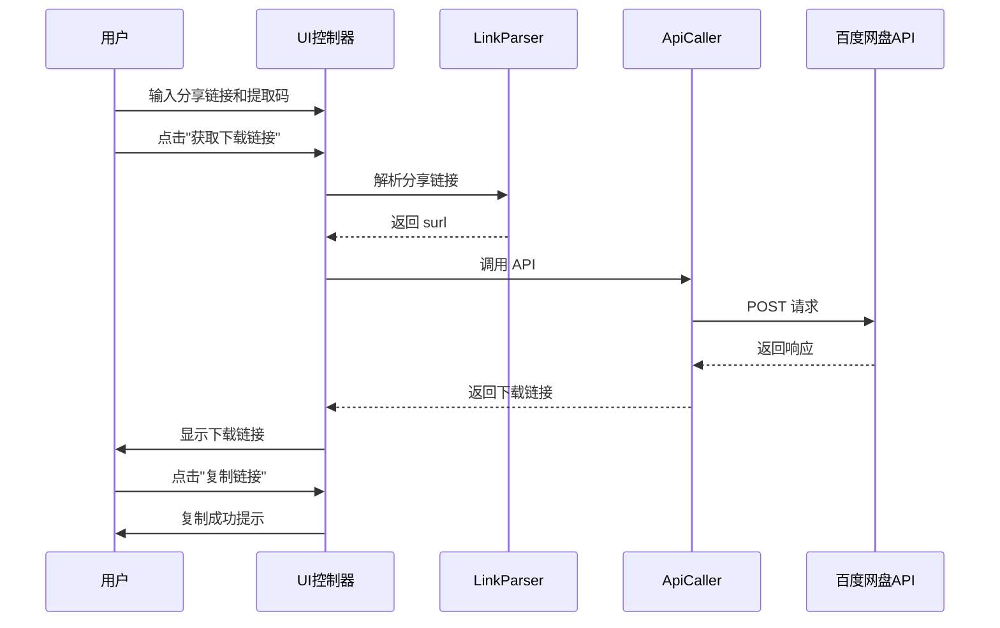

# 设计文档

## 概述

百度网盘直链获取工具是一个纯前端的独立网页应用，通过用户输入分享链接和提取码，调用百度网盘 API 获取真实下载链接，并提供复制功能。整个工具采用简洁的模块化设计，确保代码清晰可维护。

核心工作流程：
1. 用户在网页中输入百度网盘分享链接和提取码
2. 用户点击"获取下载链接"按钮
3. 工具解析分享链接，提取 surl 参数
4. 工具调用百度网盘 API 获取真实下载链接
5. 工具在页面上显示下载链接
6. 用户点击"复制链接"按钮，将链接复制到剪贴板
7. 用户使用 IDM 等下载工具粘贴链接进行下载

技术栈：
- HTML5：页面结构
- CSS3：样式和响应式布局
- JavaScript（ES6+）：业务逻辑
- Fetch API：网络请求

## 架构

### 整体架构

工具采用简单的分层架构：

```
┌─────────────────────────────────────────┐
│          用户界面层 (UI Layer)           │
│  - 输入框渲染                            │
│  - 按钮状态管理                          │
│  - 结果显示                              │
│  - 错误提示                              │
└─────────────────────────────────────────┘
                    ↓
┌─────────────────────────────────────────┐
│        业务逻辑层 (Business Layer)       │
│  - 链接解析                              │
│  - 参数验证                              │
│  - 流程控制                              │
└─────────────────────────────────────────┘
                    ↓
┌─────────────────────────────────────────┐
│        核心功能层 (Core Layer)           │
│  ┌─────────────┐  ┌─────────────┐      │
│  │ LinkParser  │  │  ApiCaller  │      │
│  │  链接解析器  │  │ API调用器   │      │
│  └─────────────┘  └─────────────┘      │
└─────────────────────────────────────────┘
                    ↓
┌─────────────────────────────────────────┐
│        平台接口层 (Platform Layer)       │
│  - Fetch API                            │
│  - Clipboard API                        │
│  - Browser DOM API                      │
└─────────────────────────────────────────┘
```

### 模块职责

1. **LinkParser（链接解析器）**
   - 解析用户输入的分享链接
   - 提取 surl 参数
   - 验证链接格式

2. **ApiCaller（API 调用器）**
   - 构造百度网盘 API 请求
   - 设置正确的请求头
   - 解析响应并提取下载链接
   - 处理错误码并返回友好错误信息
   - 实现超时控制（15秒）

3. **UIController（UI 控制器）**
   - 管理输入框和按钮状态
   - 显示下载链接
   - 显示错误提示
   - 处理复制到剪贴板功能

### 执行流程



## 组件和接口

### LinkParser 模块

```javascript
class LinkParser {
  /**
   * 解析分享链接，提取 surl
   * @param {string} input - 用户输入的分享链接
   * @returns {Object} {success: boolean, surl?: string, error?: string}
   */
  parse(input) {
    // 支持完整链接：https://pan.baidu.com/s/1xxxxx
    // 支持短链接：1xxxxx
    const patterns = [
      /pan\.baidu\.com\/s\/([a-zA-Z0-9_-]+)/,
      /^([a-zA-Z0-9_-]+)$/
    ];
    
    for (const pattern of patterns) {
      const match = input.match(pattern);
      if (match) {
        return { success: true, surl: match[1] };
      }
    }
    
    return { success: false, error: '分享链接格式不正确' };
  }

  /**
   * 验证提取码格式
   * @param {string} pwd - 提取码
   * @returns {boolean}
   */
  validatePwd(pwd) {
    return /^[a-zA-Z0-9]{4}$/.test(pwd);
  }
}
```

### ApiCaller 模块

```javascript
class ApiCaller {
  /**
   * 调用百度网盘 API 获取下载链接
   * @param {string} surl - 分享链接标识
   * @param {string} pwd - 提取码
   * @returns {Promise<Object>} {success: boolean, dlink?: string, error?: string}
   */
  async fetchDownloadLink(surl, pwd) {
    const url = this.buildUrl(surl, pwd);
    const headers = this.buildHeaders();
    
    try {
      const controller = new AbortController();
      const timeoutId = setTimeout(() => controller.abort(), 15000);
      
      const response = await fetch(url, {
        method: 'POST',
        headers: headers,
        signal: controller.signal
      });
      
      clearTimeout(timeoutId);
      
      if (!response.ok) {
        return { success: false, error: `HTTP 错误：${response.status}` };
      }
      
      const data = await response.json();
      return this.parseResponse(data);
    } catch (error) {
      if (error.name === 'AbortError') {
        return { success: false, error: '请求超时，请重试' };
      }
      return { success: false, error: error.message };
    }
  }

  /**
   * 构造请求 URL
   * @param {string} surl
   * @param {string} pwd
   * @returns {string}
   */
  buildUrl(surl, pwd) {
    const params = new URLSearchParams({
      surl: surl,
      pwd: pwd || ''
    });
    return `https://pan.baidu.com/api/sharedownload?${params}`;
  }

  /**
   * 构造请求头
   * @returns {Object}
   */
  buildHeaders() {
    return {
      'Content-Type': 'application/x-www-form-urlencoded',
      'Referer': 'https://pan.baidu.com/',
      'User-Agent': navigator.userAgent
    };
  }

  /**
   * 解析 API 响应
   * @param {Object} data
   * @returns {Object}
   */
  parseResponse(data) {
    if (data.errno === 0 && data.dlink) {
      return { success: true, dlink: data.dlink };
    }
    
    const errorMessage = this.getErrorMessage(data.errno);
    return { success: false, error: errorMessage, errno: data.errno };
  }

  /**
   * 将错误码转换为中文说明
   * @param {number} errno
   * @returns {string}
   */
  getErrorMessage(errno) {
    const errorMap = {
      '-1': '分享链接已失效',
      '-2': '分享链接不存在',
      '-3': '提取码错误',
      '-7': '文件已被删除',
      '-9': '访问频率过快，请稍后重试'
    };
    
    return errorMap[errno] || `未知错误（错误码：${errno}）`;
  }
}
```

### UIController 模块

```javascript
class UIController {
  constructor() {
    this.linkInput = document.getElementById('link-input');
    this.pwdInput = document.getElementById('pwd-input');
    this.fetchButton = document.getElementById('fetch-button');
    this.resultContainer = document.getElementById('result-container');
    this.errorContainer = document.getElementById('error-container');
  }

  /**
   * 初始化 UI 事件监听
   */
  init() {
    this.fetchButton.addEventListener('click', () => this.handleFetch());
    this.linkInput.addEventListener('input', () => this.validateInput());
  }

  /**
   * 验证输入
   */
  validateInput() {
    const hasLink = this.linkInput.value.trim().length > 0;
    this.fetchButton.disabled = !hasLink;
  }

  /**
   * 处理获取下载链接
   */
  async handleFetch() {
    const link = this.linkInput.value.trim();
    const pwd = this.pwdInput.value.trim();
    
    this.showLoading(true);
    this.clearError();
    this.clearResult();
    
    const parser = new LinkParser();
    const parseResult = parser.parse(link);
    
    if (!parseResult.success) {
      this.showError(parseResult.error);
      this.showLoading(false);
      return;
    }
    
    const apiCaller = new ApiCaller();
    const result = await apiCaller.fetchDownloadLink(parseResult.surl, pwd);
    
    this.showLoading(false);
    
    if (result.success) {
      this.showResult(result.dlink);
    } else {
      this.showError(result.error);
    }
  }

  /**
   * 显示加载状态
   * @param {boolean} loading
   */
  showLoading(loading) {
    this.fetchButton.disabled = loading;
    this.fetchButton.textContent = loading ? '获取中...' : '获取下载链接';
  }

  /**
   * 显示下载链接
   * @param {string} dlink
   */
  showResult(dlink) {
    this.resultContainer.innerHTML = `
      <div class="result">
        <p>下载链接：</p>
        <input type="text" value="${dlink}" readonly id="dlink-input">
        <button id="copy-button">复制链接</button>
      </div>
    `;
    
    document.getElementById('copy-button').addEventListener('click', () => {
      this.copyToClipboard(dlink);
    });
  }

  /**
   * 显示错误信息
   * @param {string} message
   */
  showError(message) {
    this.errorContainer.textContent = message;
    this.errorContainer.style.display = 'block';
  }

  /**
   * 清除错误信息
   */
  clearError() {
    this.errorContainer.textContent = '';
    this.errorContainer.style.display = 'none';
  }

  /**
   * 清除结果
   */
  clearResult() {
    this.resultContainer.innerHTML = '';
  }

  /**
   * 复制到剪贴板
   * @param {string} text
   */
  async copyToClipboard(text) {
    try {
      await navigator.clipboard.writeText(text);
      this.showSuccess('复制成功');
    } catch (error) {
      this.showError('复制失败，请手动复制');
    }
  }

  /**
   * 显示成功提示
   * @param {string} message
   */
  showSuccess(message) {
    const toast = document.createElement('div');
    toast.className = 'toast success';
    toast.textContent = message;
    document.body.appendChild(toast);
    
    setTimeout(() => {
      toast.remove();
    }, 2000);
  }
}
```

## 数据模型

### ParseResult（解析结果）

```javascript
{
  success: boolean,     // 是否成功
  surl: string,         // 分享链接标识（成功时）
  error: string         // 错误信息（失败时）
}
```

### ApiResponse（API 响应）

```javascript
{
  errno: number,        // 错误码（0 表示成功）
  dlink: string         // 真实下载链接（errno=0 时存在）
}
```

### FetchResult（获取结果）

```javascript
{
  success: boolean,     // 是否成功
  dlink: string,        // 下载链接（成功时）
  error: string,        // 错误信息（失败时）
  errno: number         // 错误码（失败时）
}
```

## 正确性属性

*属性是指在系统所有有效执行过程中都应该成立的特征或行为——本质上是关于系统应该做什么的形式化陈述。*

### 属性 1：链接解析正确性

*对于任意* 有效的百度网盘分享链接（完整链接或短链接），链接解析器应成功提取 surl 参数

**验证需求：2.1, 2.2**

### 属性 2：无效链接拒绝

*对于任意* 不符合百度网盘分享链接格式的输入，链接解析器应返回错误

**验证需求：2.3**

### 属性 3：API 请求正确构造

*对于任意* 有效的 surl 和 pwd，API 调用器应构造包含正确 URL、请求头的 HTTP 请求

**验证需求：3.2**

### 属性 4：成功响应正确解析

*对于任意* errno 为 0 的 API 响应，API 调用器应成功提取并返回 dlink 字段

**验证需求：3.3**

### 属性 5：错误响应正确处理

*对于任意* errno 不为 0 的 API 响应，API 调用器应返回包含错误码和对应中文说明的错误对象

**验证需求：3.4, 5.1, 5.2, 5.3, 5.4, 5.5**

### 属性 6：超时控制

*对于任意* 超过 15 秒未响应的 API 请求，应被中止并返回超时错误

**验证需求：3.5**

### 属性 7：复制功能正确性

*对于任意* 有效的下载链接，点击"复制链接"按钮后，剪贴板内容应与下载链接完全一致

**验证需求：4.2, 4.3, 4.4**

### 属性 8：按钮状态正确转换

*对于任意* 获取流程，按钮状态应按照以下顺序转换：正常 → 加载中（禁用）→ 正常（可点击）

**验证需求：6.2, 6.3**

### 属性 9：请求域名限制

*对于任意* 工具发起的网络请求，其目标 URL 的域名应匹配 `pan.baidu.com` 或其子域名

**验证需求：7.3**

### 属性 10：无主动请求

*对于任意* 页面加载到用户点击"获取下载链接"按钮之前的时间段，不应发起任何网络请求

**验证需求：7.1**

## 错误处理

### 链接解析失败

- **场景**：用户输入的链接格式不正确
- **处理**：
  1. 显示错误提示："分享链接格式不正确"
  2. 不发起 API 请求
  3. 保持按钮可点击状态

### API 请求失败

- **场景 1：网络超时（15 秒无响应）**
  - 显示提示："请求超时，请重试"
  - 恢复按钮可点击状态

- **场景 2：HTTP 错误（4xx/5xx）**
  - 显示提示："HTTP 错误：{状态码}"
  - 恢复按钮可点击状态

- **场景 3：errno 不为 0**
  - 根据错误码映射表显示中文说明：
    - `-1`: "分享链接已失效"
    - `-2`: "分享链接不存在"
    - `-3`: "提取码错误"
    - `-7`: "文件已被删除"
    - `-9`: "访问频率过快，请稍后重试"
    - 其他：`"未知错误（错误码：{errno}）"`

### 复制失败

- **场景**：浏览器不支持 Clipboard API 或用户拒绝权限
- **处理**：
  1. 显示错误提示："复制失败，请手动复制"
  2. 保持下载链接可选中状态，方便用户手动复制

## 测试策略

### 测试方法

本项目采用**双重测试方法**，结合单元测试和基于属性的测试（Property-Based Testing, PBT）。

- **单元测试**：验证具体示例、边缘情况和错误条件
- **属性测试**：验证跨所有输入的通用属性

### 单元测试

**测试框架**：Jest

**测试范围**：
1. **具体示例**：
   - 完整链接解析
   - 短链接解析
   - 提取码为空的处理
   - 各种 errno 错误码的处理

2. **边缘情况**：
   - 无效链接格式
   - 空输入
   - 超长输入
   - 特殊字符

3. **集成点**：
   - LinkParser 与输入验证
   - ApiCaller 与 Fetch API
   - UIController 与 DOM 操作

4. **错误条件**：
   - 网络请求超时
   - HTTP 错误
   - JSON 解析失败
   - 复制到剪贴板失败

**测试组织**：
```
tests/
├── unit/
│   ├── LinkParser.test.js
│   ├── ApiCaller.test.js
│   └── UIController.test.js
└── property/
    ├── LinkParser.property.test.js
    ├── ApiCaller.property.test.js
    └── UIController.property.test.js
```

### 基于属性的测试

**测试库**：fast-check

**配置要求**：
- 每个属性测试最少运行 **100 次迭代**
- 每个测试必须引用设计文档中的属性
- 标签格式：`// Feature: baidu-pan-direct-download, Property {number}: {property_text}`

**属性测试映射**：

1. **属性 1（链接解析正确性）**：
   - 生成随机的有效百度网盘链接
   - 验证解析器正确提取 surl

2. **属性 2（无效链接拒绝）**：
   - 生成随机的无效链接
   - 验证解析器返回错误

3. **属性 3（API 请求构造）**：
   - 生成随机 surl 和 pwd
   - 验证构造的请求包含正确的 URL 和请求头

4. **属性 4（成功响应解析）**：
   - 生成随机的成功响应（errno=0）
   - 验证正确提取 dlink

5. **属性 5（错误响应处理）**：
   - 生成随机的错误响应（errno≠0）
   - 验证返回正确的错误信息

6. **属性 6（超时控制）**：
   - 模拟超时请求
   - 验证在 15 秒后中止并返回超时错误

7. **属性 7（复制功能正确性）**：
   - 生成随机下载链接
   - 验证复制后剪贴板内容一致

8. **属性 9（请求域名限制）**：
   - 生成随机请求参数
   - 验证所有请求 URL 匹配百度域名

9. **属性 10（无主动请求）**：
   - 监控页面加载过程
   - 验证在用户点击前无网络请求

**生成器设计**：
- `arbValidLink()`：生成有效的百度网盘链接
- `arbInvalidLink()`：生成无效链接
- `arbSurl()`：生成随机 surl
- `arbPwd()`：生成随机提取码（4 位字符）
- `arbApiResponse()`：生成随机 API 响应
- `arbDlink()`：生成随机下载链接

### 测试环境

**模拟环境**：
- 使用 JSDOM 模拟浏览器 DOM 环境
- Mock Fetch API
- Mock Clipboard API

**测试数据**：
- 使用真实的百度网盘 API 响应样本

### 持续集成

- 所有测试在每次提交时自动运行
- 单元测试和属性测试都必须通过
- 代码覆盖率目标：≥ 80%
